# NLP-BIM Framework for Semantic Text-to-Model Alignment

###

> **🚧 Project Type**: NLP × BIM | **📅 Timeline**: Spring 2025 | **🏗️ Domain**: Architecture, Engineering, and Construction

## 🧰 Tech Stack

<div align="center">


<br><br>

[](https://skillicons.dev)

</div>

## 📳 Hugging Face Model Card

[](https://huggingface.co/ZappyKirby/client-to-bim/tree/main)

## ⬇️ Updates

- July 2025 ✨ Pretraining, Training and Validation

## 🫥 Introduction

BIM is central to AEC workflows, offering structured digital models of built assets. However, aligning unstructured text data such as specs, codes, and requirements with BIM elements remains a key challenge. NLP methods, especially transformer-based LMs, enable semantic mapping between text and BIM components. This work proposes a framework that integrates transformers with BIM to automate compliance, retrieval, and querying tasks across AEC domains.

## 🔗 BIM Architecture

```mermaid
graph LR
ClientInput["🗣️ Client Requirements"] --> NLPModule
NLPModule --> EntityExtraction["📦 Entity Recognition"]
EntityExtraction --> BIMMapper["🔧 IFC/BIM Mapper"]
BIMMapper --> ModelEngine["🏗️ Model Generator"]
ModelEngine --> Output["📐 BIM Model"]
```



## 🧪 Experiments

- Evaluation using a test suite of 30,000 annotated requirements
- Metrics: Precision, Recall, BIM-conformity accuracy

## Results

<table>
<tr>
  <td>

### ML-Architecture Results

| Model                      | F-1 Score |
| -------------------------- | --------- |
| BERT Baseline              | 87%       |
| BERT Pretrained + Baseline | 95%       |
| BERT Pretrained + Our      | 96%       |

  </td>
  <td style="padding-left:40px">

### Pretraining Results

| Model           | F-1 Score |
| --------------- | --------- |
| BERT English    | 91%       |
| BERT Korean     | 89%       |
| BERT Multingual | 90%       |

  </td>
</tr>
</table>

## 📈 Applications

- Office design automation
- Early-stage design analysis
- Requirements compliance validation

## ⚙️ Setup

### Pre-requisites

Installing CUDA toolkit using the instructions for your platform.
We recommend using `conda` to install `cudatoolkit`.

[](https://anaconda.org/conda-forge/cudatoolkit)

Install the corresponding pytorch version
from the link below. We recommend installing CUDA12.6 with the latest pytorch.

[](https://pytorch.org/get-started/locally/)

### Running the source

```sh
git clone https://github.com/ITalab/client-to-bim
```

Install requirements

```sh
pip install -r requirements.txt
```

Conda


```sh
conda env create -f environment.yml
conda activate client-to-bim
```

Poetry


```sh
curl -sSL https://install.python-poetry.org | python3 -
```

```sh
poetry install
poetry shell
```

## 📊 Dataset Overview (JSON Format)

Each entry in this dataset is organized by **class name** followed by a list of **text samples**. The structure is designed for easy parsing and use in NLP classification tasks.

### 🧾 Description

- **Keys**: Represent class labels (e.g., `OCR`, `OUU`, `OBC`).
- **Values**: Lists of string texts associated with that class.

## Download Model

```python
from huggingface_hub import hf_hub_download

file_path = hf_hub_download(repo_id="ZappyKirby/client-to-bim", filename="model.safetensors")

```

or manually download weights from hugging face

[](https://huggingface.co/ZappyKirby/client-to-bim/tree/main)

## ⚒️Training

### Pretrain

```sh
python mlm-pretrain.py
```

## 🤝 Contributing

We welcome contributors! See the [CONTRIBUTING.md]() for guidelines.

## 🗨️ Citation

```bib
@misc{ITalab_client-to-bim,
  author       = {{ITalab}},
  title        = {client-to-bim},
  howpublished = {\url{https://github.com/ITalab/client-to-bim}},
  year         = {2025},
  note         = {GitHub repository, accessed July 23, 2025},
}
```

Made with ❤️ by ITalab
